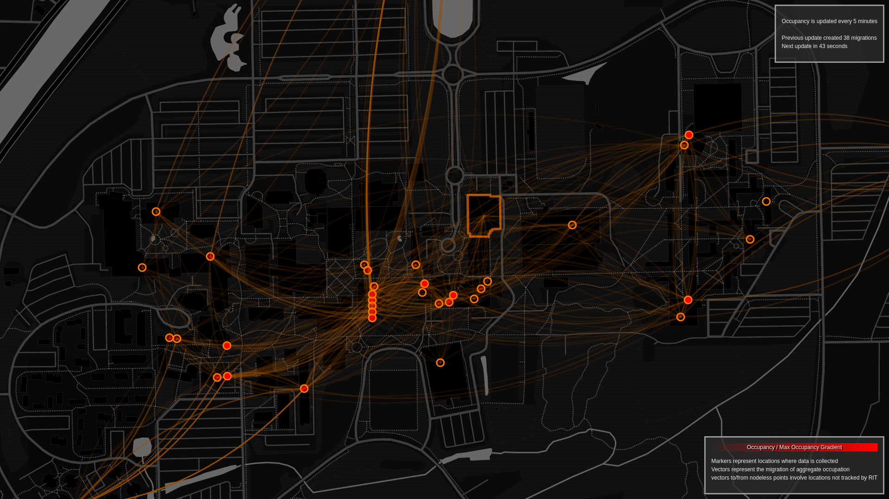

# Hotspots @ RIT

#### Wouldn't it be cool if I knew where all of the people were on campus? 

#### Wouldn't it be even cooler if I could see where people were going throughout the day?
Apparently RIT tried to answer these questions with inconsistent placement of tracking nodes and a feature nobody knows about which looks perfectly mediocre.

I poked their super secret API until I could make something better.  It can definitely be said that I tried.
Also, like... There are nodes that RIT just.. didn't use.  I fixed that.  

#### Note  about solo browser version
I'm not maintaining that.  It's just a proof of concept.  Wait 5 minutes for the first change to be detected and arrows will fly.

---
### RIT ITS should hmu.  I can fix your mess.  
And if you order now I'll also add the coolest features, free of charge.